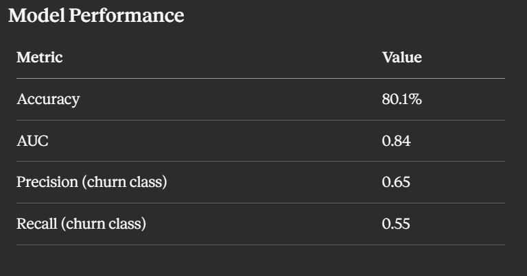
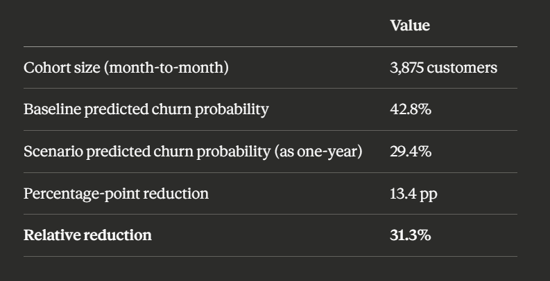

## Customer Churn & Revenue Leakage Analysis

## Business Problem
Customer churn(26%) leads to significant revenue loss. This project analyzes churn drivers and identifies high-risk customer segments to support data-driven retention strategies.

## Project Overview
Analysis of 7,043 telecom customer records to identify churn drivers and quantify the impact of a targeted retention lever (contract-type conversion) using a logistic regression model.

### Key Steps in the Project

1) Data Cleaning: Identified that TotalCharges was stored as text with blank values for zero-tenure customers; converted to numeric and imputed missing values as MonthlyCharges × tenure.
2) Exploratory Data Analysis: Generated 11 visualizations (histograms, heatmaps, box plots) to surface churn patterns across tenure, charges, and contract type before any modeling.
3) Feature Engineering: Selected 12 features with a clear business rationale (tenure, charges, contract type, internet service, payment method, security/support add-ons, demographics); one-hot encoded categoricals, standardized numeric features.
4) Model Training: Built a logistic regression model — chosen specifically for coefficient interpretability over black-box predictive power — using an 80/20 stratified train/test split.
5) Model Evaluation: Assessed performance using accuracy, AUC, precision, and recall (not accuracy alone, given class imbalance).
6) Retention Scenario Simulation: Used the trained model to simulate a targeted intervention — shifting month-to-month customers to one-year contracts — and measured the projected change in churn probability, holding all other customer attributes constant.

### Key Insights
- Overall churn rate: 26.5%
- Month-to-month contract churn rate: 42.7% vs. one-year 11.3% vs. two-year 2.8% — roughly a 3× gap between month-to-month and one-year
- Strongest churn-reducing factor: tenure (longer-tenured customers are significantly less likely to churn)
- Strongest churn-increasing factors: month-to-month contract, higher monthly/total charges, fiber optic internet, electronic check payment, absence of tech support or online security

### Retention Scenario: Contract-Type Simulation

For the 3,875 month-to-month customers, the model's predicted churn probability was computed as-is (baseline), then recomputed after changing only their Contract field to "One year" — holding tenure, charges, and every other attribute constant. This isolates the effect of contract type specifically, rather than naively comparing two different customer groups.

Important limitation: This is a correlational simulation based on patterns the model learned in historical data — it is not a causal claim. Customers who choose longer contracts may differ from month-to-month customers in unmeasured ways (e.g., price sensitivity, commitment level) that also correlate with lower churn, independent of contract type itself. A rigorous causal estimate would require a controlled A/B test — offering a sample of month-to-month customers a contract-switch incentive and measuring actual churn outcomes against a control group.

### Tools Used
- SQL/MySQL — Initial data exploration
- Python — Pandas, NumPy (data cleaning, feature engineering), Scikit-learn (Logistic Regression, train/test splitting, evaluation metrics), Matplotlib & Seaborn (Visualization)
- Power BI

## 📊 Dashboard Overview

### Live Dashboard : [Link](https://app.powerbi.com/groups/06cdec44-3220-48a9-87bc-6d3241c1bca6/reports/65daef2f-cd8b-4527-b6d4-20a948c632bf/bba25b9641cb9af9ab42?ctid=2bb44e71-1601-4af2-a592-4224ddcfb1c3&experience=power-bi)

### Recommendations
- Promote long-term contracts
- Focus on early-tenure engagement
- Target high-revenue churn segments

### Data Set

Dataset used: Telco Customer Churn — Kaggle / IBM Sample Data Sets

