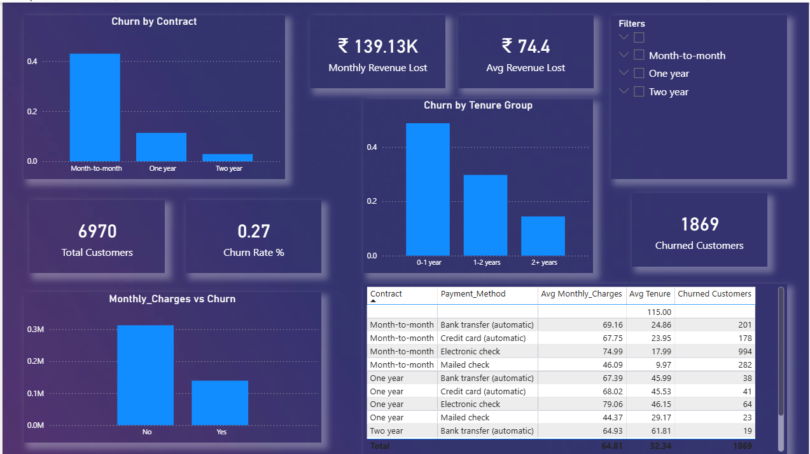

## Customer Churn & Revenue Leakage Analysis

### Business Problem
Customer churn leads to significant revenue loss. This project analyzes churn drivers and identifies high-risk customer segments to support data-driven retention strategies.

### Tools Used
- SQL (MySQL)
- Python (Pandas, Matplotlib, Seaborn)
- Power BI

### Key Insights
- Month-to-month contracts have the highest churn rate
- Low-tenure customers are more likely to churn
- High monthly charges correlate with increased churn
- A small customer segment contributes to majority of revenue loss

## 📊 Dashboard Overview

### Live Dashboard : [Link](https://app.powerbi.com/groups/06cdec44-3220-48a9-87bc-6d3241c1bca6/reports/65daef2f-cd8b-4527-b6d4-20a948c632bf/bba25b9641cb9af9ab42?ctid=2bb44e71-1601-4af2-a592-4224ddcfb1c3&experience=power-bi)

### Recommendations
- Promote long-term contracts
- Focus on early-tenure engagement
- Target high-revenue churn segments

